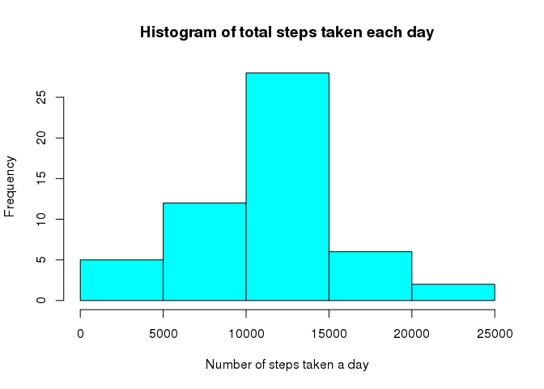
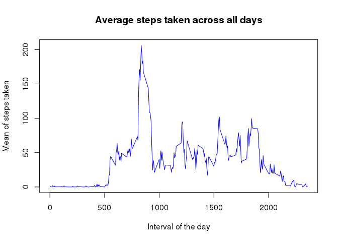
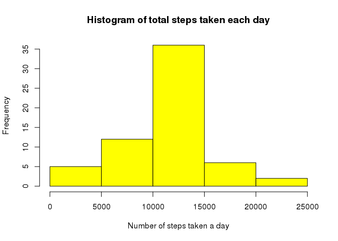
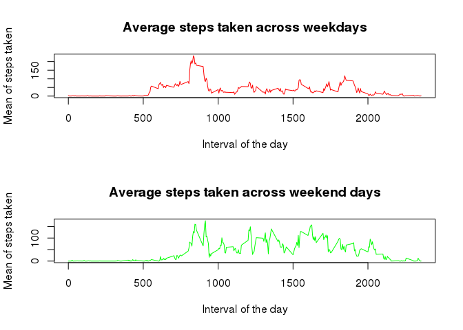

## Loading and preprocessing the data
Read the data from the zip file, also remove NA values from it (na.omit). Convert the date field to Date data type. 

```r
raw <- read.csv(unz("activity.zip","activity.csv"), header = TRUE, 
                         quote="\"", sep=",")
data <- na.omit(raw)
data$date <- as.Date(data$date)
head(data)
```

```
##     steps       date interval
## 289     0 2012-10-02        0
## 290     0 2012-10-02        5
## 291     0 2012-10-02       10
## 292     0 2012-10-02       15
## 293     0 2012-10-02       20
## 294     0 2012-10-02       25
```

## What is mean total number of steps taken per day?
Calculate the total number of steps taken each day. Make a histogram of it.

```r
sum_per_day <- aggregate(data['steps'], by = data['date'], FUN=sum)
hist(sum_per_day$steps, xlab = "Number of steps taken a day", ylab = "Frequency", 
     main = "Histogram of total steps taken each day", col = 5)
```

<!-- -->

The mean of the total number of steps taken each day. 

```r
mean_steps <- mean(sum_per_day$steps)
mean_steps
```

```
## [1] 10766.19
```

The median of the total number of steps taken each day. 

```r
median_steps <- median(sum_per_day$steps)
median_steps
```

```
## [1] 10765
```

## What is the average daily activity pattern?
Calculate the average steps for all the different intervals across days. 

```r
mean_per_interval <- aggregate(data['steps'], by = data['interval'], FUN=mean)
```
Make a line plot of it. 

```r
plot(x = mean_per_interval$interval, y = mean_per_interval$steps, 
     xlab = "Interval of the day", ylab = "Mean of steps taken", 
     main = "Average steps taken across all days" ,
     col = 4, type = 'l')
```

<!-- -->
On average, the maximum number of steps taken is the interval '835'.

```r
mean_per_interval[order(-mean_per_interval$steps),][1:10,]
```

```
##     interval    steps
## 104      835 206.1698
## 105      840 195.9245
## 107      850 183.3962
## 106      845 179.5660
## 103      830 177.3019
## 101      820 171.1509
## 108      855 167.0189
## 100      815 157.5283
## 102      825 155.3962
## 109      900 143.4528
```

## Imputing missing values
Calculate the number of missing values.

```r
num_of_na <- sum(is.na(raw$steps))
num_of_na
```

```
## [1] 2304
```

Create a new data frame based on the raw one, and replace the missing values with the mean of the given interval, calculated previously. 

```r
data_ext <- raw
for (r in 1:nrow(data_ext)) {
    if(is.na(data_ext[r,"steps"])) {
        data_ext[r,"steps"] <- mean_per_interval[mean_per_interval$interval == data_ext[r,"interval"],"steps"]
    }
}
head(data_ext)
```

```
##       steps       date interval
## 1 1.7169811 2012-10-01        0
## 2 0.3396226 2012-10-01        5
## 3 0.1320755 2012-10-01       10
## 4 0.1509434 2012-10-01       15
## 5 0.0754717 2012-10-01       20
## 6 2.0943396 2012-10-01       25
```

For the extended dataset, calculate the total number of steps taken each day. Make a histogram of it.

```r
sum_per_day_ext <- aggregate(data_ext['steps'], by = data_ext['date'], FUN=sum)
hist(sum_per_day_ext$steps, xlab = "Number of steps taken a day", ylab = "Frequency", 
     main = "Histogram of total steps taken each day", col = 7)
```

<!-- -->

For the extended dataset, the mean of the total number of steps taken each day. 

```r
mean_steps_ext <- mean(sum_per_day_ext$steps)
mean_steps_ext
```

```
## [1] 10766.19
```

For the extended dataset, the median of the total number of steps taken each day. 

```r
median_steps_ext <- median(sum_per_day_ext$steps)
median_steps_ext
```

```
## [1] 10766.19
```

As the NA values was corrigated with mean values, the mean of the total number of steps is unchanged. However, the median has increased a little, and became equal to the mean. 

## Are there differences in activity patterns between weekdays and weekends?

Extend the data frame with a column indicating if the measure happened at a weekday or weekend. 

```r
wd <- c('Mon','Tue','Wed','Thu','Fri')
data$weekpart <- factor(weekdays(data$date, abbreviate = T) %in% wd, 
                        levels = c(TRUE, FALSE), labels = c('weekday', 'weekend'))
head(data)
```

```
##     steps       date interval weekpart
## 289     0 2012-10-02        0  weekday
## 290     0 2012-10-02        5  weekday
## 291     0 2012-10-02       10  weekday
## 292     0 2012-10-02       15  weekday
## 293     0 2012-10-02       20  weekday
## 294     0 2012-10-02       25  weekday
```

Calculate the average steps for all the different intervals across weekend and weekdays.  

```r
mean_per_interval_wd <- aggregate(data[data$weekpart == 'weekday','steps'], 
                                  by = list(data[data$weekpart == 'weekday','interval']), 
                                  FUN=mean)
mean_per_interval_wd <- setNames(mean_per_interval_wd, c('interval','steps'))

mean_per_interval_we <- aggregate(data[data$weekpart == 'weekend','steps'], 
                                  by = list(data[data$weekpart == 'weekend','interval']), 
                                  FUN=mean)
mean_per_interval_we <- setNames(mean_per_interval_we, c('interval','steps'))
```

Make a line plot of the two to be able to compare them. 

```r
par(mfrow=c(2,1)) 

plot(x = mean_per_interval_wd$interval, y = mean_per_interval_wd$steps, 
     xlab = "Interval of the day", ylab = "Mean of steps taken", 
     main = "Average steps taken across weekdays" ,
     col = 'red', type = 'l')

plot(x = mean_per_interval_we$interval, y = mean_per_interval_we$steps, 
     xlab = "Interval of the day", ylab = "Mean of steps taken", 
     main = "Average steps taken across weekend days" ,
     col = 'green', type = 'l')
```

<!-- -->

We can see some difference between the weekdays and weekend. At the weekends, people get up later, but more active in the afternoon. 


